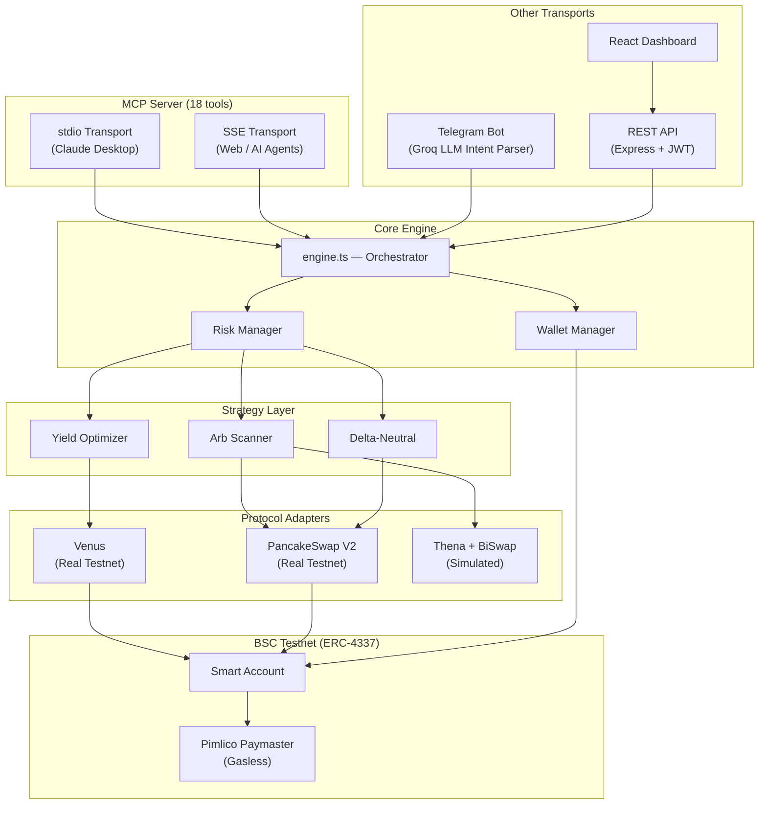
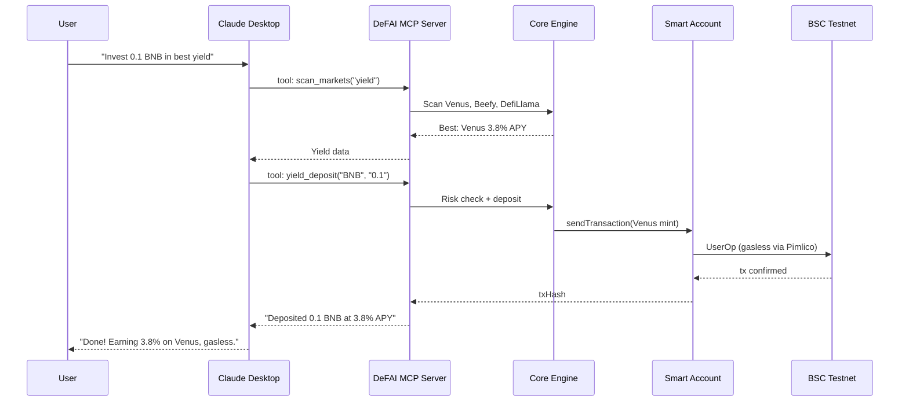

# DeFAI MCP — AI-Powered DeFi Agent for BNB Chain via Model Context Protocol

[](LICENSE)
[](https://nodejs.org/)
[](https://www.typescriptlang.org/)
[](https://www.bnbchain.org/)
[](https://eips.ethereum.org/EIPS/eip-4337)
[](https://modelcontextprotocol.io/)

**The first MCP server that gives AI agents real DeFi execution on BNB Chain.** 18 MCP tools for yield farming, cross-DEX arbitrage, and delta-neutral strategies — all gasless via ERC-4337 Account Abstraction.

---

## Why MCP?

AI assistants like Claude can reason about DeFi — but they can't **do** DeFi. There are zero MCP servers for on-chain DeFi operations on BNB Chain. DeFAI MCP changes that.

**With DeFAI MCP installed, Claude can:**
```
You:    "What are the best yields on BSC?"
Claude: [calls scan_markets tool] → "Venus BNB is at 3.8% APY, highest across 60+ pools"

You:    "Deposit 0.1 BNB into Venus"
Claude: [calls yield_deposit tool] → Real on-chain tx, gasless → "Done. Position tracked."

You:    "Run arbitrage for 6 hours, stop if I lose $5"
Claude: [calls arb_auto_start tool] → Autonomous bot scanning every 30s

You:    "How's my portfolio?"
Claude: [calls portfolio tool] → Full breakdown: positions, PnL, yield earned
```

This isn't a chatbot wrapper. It's a **full DeFi execution layer** exposed as MCP tools.

---

## 18 MCP Tools — Full DeFi Toolkit for AI Agents

| Tool | What it does |
|---|---|
| `ping` | Test connectivity to DeFAI MCP server |
| `wallet_setup` | Register/resume wallet, get Smart Account address |
| `scan_markets` | Live APYs (Venus/Beefy/DefiLlama), DEX prices, funding rates, arb spreads |
| `yield_deposit` | Deposit into highest-APY protocol (auto-selects best) |
| `yield_rotate` | Rotate position to higher APY when rates shift |
| `swap_tokens` | PancakeSwap V2 swap (BNB, USDT, any pair) |
| `arb_execute` | Scan cross-DEX spreads and execute best arbitrage |
| `arb_auto_start` | Start autonomous arb bot (scans every 30s for N hours) |
| `arb_auto_stop` | Stop the autonomous arb session |
| `arb_auto_status` | Check auto-arb P&L, trades executed, time remaining |
| `delta_neutral_open` | Open hedged position: spot buy + virtual short |
| `delta_neutral_close` | Close delta-neutral position, realize PnL |
| `risk_config` | View/update risk limits (position size, slippage, exposure) |
| `set_alerts` | Enable APY drop, arb opportunity, or position health alerts |
| `get_alerts` | View alert configs and last trigger times |
| `link_telegram` | Link Telegram for alert delivery |
| `portfolio` | Full portfolio: positions, PnL, yield earned |
| `trade_history` | Past trades with type/limit filters |

**MCP Resources:** `defai://protocols` — lists all supported protocols with real vs simulated status.

### MCP Transport Modes

- **stdio** — For Claude Desktop. Add to `claude_desktop_config.json` and tools appear in Claude's palette.
- **SSE** — For web apps and custom AI agents. HTTP endpoint on port 3001 with Bearer auth.

---

## Architecture



## How Claude Uses DeFAI MCP



---

## Key Features

| Feature | Description |
|---|---|
| **18 MCP Tools** | Full DeFi toolkit for any AI agent — scan, deposit, swap, arb, hedge, monitor |
| **Dual MCP Transport** | stdio (Claude Desktop) + SSE (web apps, custom agents) |
| **Yield Optimization** | Aggregates Venus, Beefy, DefiLlama (60+ pools). Auto-deposits and rotates. |
| **Cross-DEX Arbitrage** | Scans PancakeSwap, Thena, BiSwap every 30s. Auto-executes profitable spreads. |
| **Delta-Neutral Strategies** | Spot buy + virtual short. Earns funding yield with minimal risk. |
| **AI Intent Parser** | Groq Llama 3.3 70B for Telegram natural language commands. |
| **Gasless Execution** | ERC-4337 Smart Accounts via Pimlico. Users never pay gas. |
| **Multi-User Isolation** | Each user gets their own Smart Account. Keys encrypted AES-256-GCM. |
| **Real-Time Monitoring** | 5 cron watchers: APY drops, arb opps, position health, snapshots, auto-arb. |
| **Risk Management** | Per-user limits: position size, exposure, slippage, protocol allowlist. |

---

## Quick Start

### Prerequisites

- Node.js 18+ and npm 9+
- BSC Testnet BNB from [faucet](https://www.bnbchain.org/en/testnet-faucet)
- [Pimlico API key](https://www.pimlico.io/) (free tier)
- [Groq API key](https://console.groq.com/) (free tier)
- [Telegram Bot Token](https://t.me/BotFather)

### Install & Run

```bash
git clone https://github.com/<your-org>/defai-bharat.git
cd defai-bharat
npm install --legacy-peer-deps
cp .env.example .env
# Fill in your API keys in .env

# Start everything (bot + crons + API)
npm run dev

# In another terminal, start the dashboard
npm run dashboard
```

### Use with Claude Desktop (MCP)

Add to your `claude_desktop_config.json`:
```json
{
  "mcpServers": {
    "defai": {
      "command": "npm",
      "args": ["run", "mcp"],
      "cwd": "/path/to/defai-bharat"
    }
  }
}
```

Restart Claude Desktop — DeFAI tools now appear in Claude's tool palette.

### Docker (one command)

```bash
docker-compose up --build
# API + Dashboard on http://localhost:3002
```

### Verify

```bash
curl http://localhost:3002/api/health
# {"status":"ok","service":"defai-api","version":"1.0.0","chain":"BSC Testnet (97)"}
```

---

## Tech Stack

| Layer | Technology |
|---|---|
| **MCP Server** | @modelcontextprotocol/sdk (stdio + SSE) |
| Blockchain | viem + BSC Testnet (Chain 97) |
| Account Abstraction | permissionless + Pimlico (ERC-4337 v0.7) |
| AI / LLM | Groq SDK (Llama 3.3 70B) |
| Telegram Bot | Telegraf |
| REST API | Express 5 + JWT |
| Dashboard | React + Vite + Tailwind CSS + React Query |
| Database | better-sqlite3 (WAL mode) |
| Encryption | AES-256-GCM + scrypt |
| Monitoring | node-cron (5 background watchers) |
| Language | TypeScript (strict mode, ES2022) |

---

## On-Chain Contracts (BSC Testnet)

| Contract | Address | Explorer |
|---|---|---|
| EntryPoint v0.7 | `0x0000000071727De22E5E9d8BAf0edAc6f37da032` | [View](https://testnet.bscscan.com/address/0x0000000071727De22E5E9d8BAf0edAc6f37da032) |
| SimpleAccountFactory v0.7 | `0x91E60e0613810449d098b0b5Ec8b51A0FE8c8985` | [View](https://testnet.bscscan.com/address/0x91E60e0613810449d098b0b5Ec8b51A0FE8c8985) |
| Pimlico Paymaster | `0x0000000000000039cd5e8aE05257CE51C473ddd1` | [View](https://testnet.bscscan.com/address/0x0000000000000039cd5e8aE05257CE51C473ddd1) |
| Venus vBNB | `0x2E7222e51c0f6e98610A1543Aa3836E092CDe62c` | [View](https://testnet.bscscan.com/address/0x2E7222e51c0f6e98610A1543Aa3836E092CDe62c) |
| PancakeSwap V2 Router | `0xD99D1c33F9fC3444f8101754aBC46c52416550D1` | [View](https://testnet.bscscan.com/address/0xD99D1c33F9fC3444f8101754aBC46c52416550D1) |
| WBNB Testnet | `0xae13d989daC2f0dEbFf460aC112a837C89BAa7cd` | [View](https://testnet.bscscan.com/address/0xae13d989daC2f0dEbFf460aC112a837C89BAa7cd) |
| USDT Testnet | `0x337610d27c682E347C9cD60BD4b3b107C9d34dDd` | [View](https://testnet.bscscan.com/address/0x337610d27c682E347C9cD60BD4b3b107C9d34dDd) |

See [`bsc.address`](bsc.address) for the full list with notes.

---

## Documentation

| Document | Contents |
|---|---|
| [docs/PROJECT.md](docs/PROJECT.md) | Problem, solution, MCP tools, business model, roadmap |
| [docs/TECHNICAL.md](docs/TECHNICAL.md) | Architecture, setup guide, demo walkthrough |
| [docs/EXTRAS.md](docs/EXTRAS.md) | Demo video, slides, live access links |
| [bsc.address](bsc.address) | On-chain contract addresses |

---

## Project Structure

```
src/
├── mcp/                MCP server (18 tools) + stdio/SSE transports    ← CORE
│   ├── server.ts       MCP tool registration, session management
│   └── tools/          12 tool implementation files
├── core/               Engine, DB, user resolver, wallet manager, risk manager
│   ├── engine.ts       Single orchestrator — MCP + all transports call this
│   ├── strategy/       Yield optimizer, arb scanner, delta-neutral
│   └── scanner/        APY aggregator, price aggregator, funding rates, cache
├── adapters/           Protocol adapters (Venus, PancakeSwap, Thena, BiSwap)
├── bot/                Telegram bot + Groq intent parser
├── api/                Express REST API + JWT auth + routes
├── monitor/            Background cron watchers + auto-arb executor
├── wallet/             Pimlico Smart Account + AES-256-GCM encryption
└── utils/              Logger, constants, storage

dashboard/              React SPA (Vite + Tailwind + React Query)
```

---

## License

[MIT](LICENSE)

---

Built by **DefAI MCP** for the BNBChain Hackathon.
