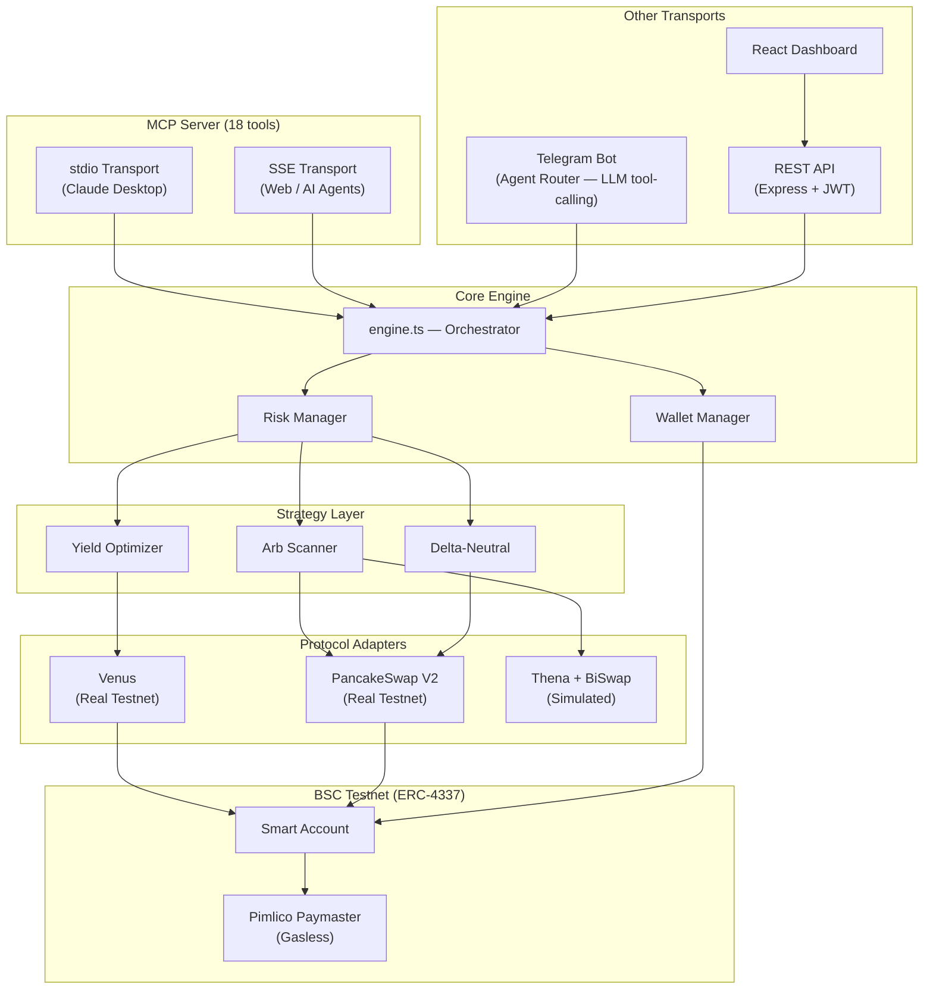

# DeFAI MCP — AI-Powered DeFi Agent for BNB Chain via Model Context Protocol

[](LICENSE)
[](https://nodejs.org/)
[](https://www.typescriptlang.org/)
[](https://www.bnbchain.org/)
[](https://eips.ethereum.org/EIPS/eip-4337)
[](https://modelcontextprotocol.io/)

**The first MCP server that gives AI agents real DeFi execution on BNB Chain.** 18 MCP tools for yield farming, cross-DEX arbitrage, and delta-neutral strategies — all gasless via ERC-4337 Account Abstraction.

---

## Why MCP?

AI assistants like Claude can reason about DeFi — but they can't **do** DeFi. There are zero MCP servers for on-chain DeFi operations on BNB Chain. DeFAI MCP changes that.

**With DeFAI MCP installed, Claude can:**
```
You:    "What are the best yields on BSC?"
Claude: [calls scan_markets tool] → "Venus BNB is at 3.8% APY, highest across 60+ pools"

You:    "Deposit 0.1 BNB into Venus"
Claude: [calls yield_deposit tool] → Real on-chain tx, gasless → "Done. Position tracked."

You:    "Run arbitrage for 6 hours, stop if I lose $5"
Claude: [calls arb_auto_start tool] → Autonomous bot scanning every 30s

You:    "How's my portfolio?"
Claude: [calls portfolio tool] → Full breakdown: positions, PnL, yield earned
```

This isn't a chatbot wrapper. It's a **full DeFi execution layer** exposed as MCP tools.

---

## 18 MCP Tools — Full DeFi Toolkit for AI Agents

| Tool | What it does |
|---|---|
| `ping` | Test connectivity to DeFAI MCP server |
| `wallet_setup` | Register/resume wallet, get Smart Account address |
| `scan_markets` | Live APYs (Venus/Beefy/DefiLlama), DEX prices, funding rates, arb spreads |
| `yield_deposit` | Deposit into highest-APY protocol (auto-selects best) |
| `yield_rotate` | Rotate position to higher APY when rates shift |
| `swap_tokens` | PancakeSwap V2 swap (BNB, USDT, any pair) |
| `arb_execute` | Scan cross-DEX spreads and execute best arbitrage |
| `arb_auto_start` | Start autonomous arb bot (scans every 30s for N hours) |
| `arb_auto_stop` | Stop the autonomous arb session |
| `arb_auto_status` | Check auto-arb P&L, trades executed, time remaining |
| `delta_neutral_open` | Open hedged position: spot buy + virtual short |
| `delta_neutral_close` | Close delta-neutral position, realize PnL |
| `risk_config` | View/update risk limits (position size, slippage, exposure) |
| `set_alerts` | Enable APY drop, arb opportunity, or position health alerts |
| `get_alerts` | View alert configs and last trigger times |
| `link_telegram` | Link Telegram for alert delivery |
| `portfolio` | Full portfolio: positions, PnL, yield earned |
| `trade_history` | Past trades with type/limit filters |

**MCP Resources:** `defai://protocols` — lists all supported protocols with real vs simulated status.

---

## Complete Setup Guide

Follow every step in order. Each step is required.

---

### Step 1 — Install prerequisites

You need **Node.js 18 or higher** and **npm 9 or higher**.

```bash
# Check your versions
node --version   # must be >= 18.0.0
npm --version    # must be >= 9.0.0
```

If Node.js is not installed, download it from [nodejs.org](https://nodejs.org/) (choose the LTS version).

---

### Step 2 — Get your API keys

You need **four external API keys** before you can run the project. Get them now, in any order.

#### 2a. Pimlico API key (pays gas fees for users)

1. Go to [dashboard.pimlico.io](https://dashboard.pimlico.io/)
2. Sign up for a free account
3. Create a new API key
4. In the API key settings, **enable BSC Testnet** (Chain ID 97)
5. Copy the key — it looks like `pim_xxxxxxxxxxxxxxxxxxxx`

#### 2b. Groq API key (LLM for Telegram natural language)

1. Go to [console.groq.com](https://console.groq.com/)
2. Sign up for a free account
3. Navigate to **API Keys** → **Create API Key**
4. Copy the key — it looks like `gsk_xxxxxxxxxxxxxxxxxxxx`

#### 2c. Telegram Bot token (bot interface)

1. Open Telegram and search for **@BotFather**
2. Send `/newbot`
3. Choose a name (e.g. `DeFAI MCP`) and a username (e.g. `defai_mcp_bot` — must end in `bot`)
4. BotFather sends you a token — it looks like `123456789:ABCdef...`
5. Save both the **token** and the **@username** (without the `@`)

#### 2d. Generate a private key (your agent's on-chain identity)

This is an Ethereum EOA private key used to create your Smart Account on BSC Testnet. Generate one securely:

```bash
openssl rand -hex 32
# outputs: a64f3c...  (64 hex characters — this is your PRIVATE_KEY)
```

> **Important**: Never use a wallet that holds real mainnet funds. Generate a fresh key for this agent.

#### 2e. Generate a JWT secret (dashboard authentication)

```bash
openssl rand -base64 32
# outputs: something like: K9mX2p...== (this is your JWT_SECRET)
```

---

### Step 3 — Clone the repository and install dependencies

```bash
git clone https://github.com/<your-org>/defai-mcp.git
cd defai-mcp

# Install backend dependencies
# --legacy-peer-deps is required due to a viem/permissionless peer conflict
npm install --legacy-peer-deps

# Install dashboard dependencies
cd dashboard && npm install && cd ..
```

---

### Step 4 — Configure your environment file

The project includes a `.env.example` template with detailed comments for each variable:

```bash
cp .env.example .env
```

Open the `[.env.example](.env.example)` file to see full descriptions of each variable, then fill in your `.env`:

| Variable | Required | Get it from |
|---|---|---|
| `PRIVATE_KEY` | **Yes** | Generate: `openssl rand -hex 32` |
| `PIMLICO_API_KEY` | **Yes** | [dashboard.pimlico.io](https://dashboard.pimlico.io/) (enable BSC Testnet) |
| `TELEGRAM_BOT_TOKEN` | **Yes** | [@BotFather](https://t.me/BotFather) on Telegram (`/newbot`) |
| `TELEGRAM_BOT_USERNAME` | **Yes** | From BotFather (without the `@` sign) |
| `GROQ_API_KEY` | **Yes** | [console.groq.com/keys](https://console.groq.com/keys) |
| `JWT_SECRET` | **Yes** | Generate: `openssl rand -base64 32` |
| `ENCRYPTION_KEY` | No | Defaults to `defai-dev-default` (for testnet) |
| `BSC_TESTNET_RPC` | No | Leave blank for default public RPC |
| `MCP_TRANSPORT` | No | Leave blank (defaults to `stdio` for Claude Desktop) |
| `DEFAI_USER_ID` | No | Leave blank on first run — fill in after dashboard registration |
| `TINYFISH_API_KEY` | No | Optional feature |

**Your completed `.env` should look like:**

```env
PRIVATE_KEY=a64f3c8d...your64hexchars...
PIMLICO_API_KEY=pim_xxxxxxxxxxxxxxxxxxxx
TELEGRAM_BOT_TOKEN=123456789:ABCdef...
TELEGRAM_BOT_USERNAME=defai_mcp_tele_bot
GROQ_API_KEY=gsk_xxxxxxxxxxxxxxxxxxxx
JWT_SECRET=K9mX2p...==
ENCRYPTION_KEY=
BSC_TESTNET_RPC=
MCP_TRANSPORT=
DEFAI_USER_ID=
TINYFISH_API_KEY=
```

> **Tip**: See [.env.example](.env.example) for the full list of variables with detailed comments explaining each one.

---

### Step 5 — Start the backend

In **Terminal 1**, run:

```bash
npm run dev
```

You should see logs like:
```
[INFO] SQLite database initialized
[INFO] REST API server started on port 3002
[INFO] Telegram bot launched
[INFO] Yield watcher started (every 5 min)
[INFO] Arb watcher started (every 2 min)
```

Leave this running. If you see errors, check the [Troubleshooting](#troubleshooting) section.

---

### Step 6 — Start the dashboard

In **Terminal 2**, run:

```bash
cd dashboard && npm run dev
```

You should see `Local: http://localhost:5173`. Leave this running.

---

### Step 7 — Register on the dashboard

> **This is how your private key stays private.** You enter it once in a secure HTTPS form. The server encrypts it with AES-256-GCM and returns a UUID you use everywhere else — Claude and Telegram never see your private key.

1. Open [http://localhost:5173](http://localhost:5173)
2. The **Register** tab should be selected by default
3. Paste your private key into the **Private Key** field (it's masked — shows dots)
4. Click **Register**

You should see a green "Registration successful!" banner with three items:

| Item | What it is |
|---|---|
| **Smart Account address** | Your ERC-4337 gasless wallet on BSC Testnet — click to view on BSCScan |
| **User ID (UUID)** | Your identity token — used in Claude config and Telegram `/connect` |
| **API Key** (`dfai_k_...`) | Used to log in to the dashboard |

**Copy both the UUID and the API Key and save them.** The page also shows ready-to-use setup instructions for Claude and Telegram — keep it open for the next steps.

---

### Step 8 — Fund your Smart Account

Your Smart Account needs a small amount of testnet BNB to execute on-chain transactions.

1. Copy the **Smart Account address** from the registration page
2. Go to [testnet.bnbchain.org/faucet-smart](https://testnet.bnbchain.org/faucet-smart)
3. Paste your Smart Account address and request testnet BNB (you'll receive 0.1 BNB)
4. Verify on [testnet.bscscan.com](https://testnet.bscscan.com) — paste the address and confirm the balance

> Pimlico sponsors gas via the Paymaster, but the Smart Account still needs a small BNB balance for BSC Testnet interactions.

---

### Step 9 — Build and configure Claude Desktop

> **How MCP works with Claude Desktop:** You do **not** run `npm run mcp` manually. Claude Desktop reads the config below and **spawns the MCP server itself** as a background child process when it opens — and kills it when it closes. You just need the compiled output to exist.

First, compile the TypeScript:

```bash
npm run build
# This creates dist/ — Claude Desktop loads dist/src/mcp/server.js
```

> Re-run `npm run build` any time you update the code and want Claude Desktop to pick up the changes.

---

Open your Claude Desktop config:

| OS | Location |
|---|---|
| macOS | `~/Library/Application Support/Claude/claude_desktop_config.json` |
| Windows | `%APPDATA%\Claude\claude_desktop_config.json` |

Replace (or add) the `defai` block with:

```json
{
  "mcpServers": {
    "defai": {
      "command": "/opt/homebrew/bin/node",
      "args": ["dist/src/mcp/server.js"],
      "cwd": "/absolute/path/to/defai-mcp",
      "env": {
        "DEFAI_USER_ID": "<paste your UUID here>"
      }
    }
  }
}

eg: {
  "preferences": {
    "coworkScheduledTasksEnabled": true,
    "sidebarMode": "chat",
    "coworkWebSearchEnabled": false
  },
  "mcpServers": {
    "defai": {
      "command": "/opt/homebrew/bin/node",
      "args": [
        "--require",
        "/Users/user/Documents/LEARNING/breaking down /defai-mcp/loadEnv.js",
        "/Users/user/Documents/LEARNING/breaking down /defai-mcp/dist/src/mcp/server.js"
      ],
      "env": {
        "DEFAI_USER_ID": "<your dashboard generated user id from private key>"
      }
    }
  }
}
```

Replace `/absolute/path/to/defai-mcp` with the actual path, and paste your UUID from Step 7 into `DEFAI_USER_ID`.

**Quit Claude Desktop completely (Cmd+Q) and reopen it.**

---

### Step 10 — Test MCP in Claude

Once Claude restarts, open a new conversation and try these in order:

```
ping the defai server
→ pong — DeFAI MCP is alive on BSC Testnet (Chain 97)

show my portfolio
→ Your smart account address + empty positions (no wallet_setup needed!)

scan all markets
→ Live APYs from Venus/Beefy, BNB/USDT prices, funding rates, arb opportunities

show my risk settings
→ Default limits (max position $1000, etc.)
```

If you want to test a live deposit:
1. Fund your smart account first (Step 8)
2. Then ask Claude: `deposit 0.01 BNB to best yield`

**MCP with SSE transport** (optional — for web apps or remote AI agents only):

```bash
# Terminal 3 (optional): MCP server with SSE transport (HTTP on port 3001)
npm run mcp:sse
```

Then connect with your API key as a Bearer token. This is **not needed** for normal Claude Desktop use.

---

### Step 11 — Connect Telegram

> **Live bot:** [@defai_mcp_tele_bot](https://t.me/defai_mcp_tele_bot) — or search `@defai_mcp_tele_bot` in Telegram. If you're running your own instance, use the bot you created with BotFather in Step 2c.

1. Open [t.me/defai_mcp_tele_bot](https://t.me/defai_mcp_tele_bot) (or your own bot)
2. Send `/start` — you'll see the welcome message
3. Send `/connect <your-UUID>` (the UUID from Step 7)
4. The bot replies: "Linked! Your Telegram is now connected to user..."
5. Send `/portfolio` — should show the same data as MCP

Try natural language — the bot uses a Groq LLM agent router:
```
/scan                                   — market data
how much BNB can I earn in a week       — conversational reply from LLM
deposit 0.05 BNB in best yield          — bot asks for confirmation, then executes
```

---

### Step 12 — Log in to the dashboard

1. Go back to [http://localhost:5173](http://localhost:5173)
2. Click **Go to Login** (or switch to the Login tab)
3. Paste your **API Key** (`dfai_k_...` from Step 7)
4. Click **Login**

Navigate through the sections:
- **Portfolio** — smart account address, open positions, total value
- **Trades** — trade history (everything done via MCP or Telegram appears here)
- **Markets** — live APYs, prices, historical charts
- **Settings** — alert configuration

Everything done via MCP tools or Telegram is recorded in the same SQLite DB — it all shows up here in real-time.

---

### Step 13 — Verify everything is working

```bash
# Backend health check
curl http://localhost:3002/api/health
# Expected: {"status":"ok","service":"defai-api","chain":"BSC Testnet (97)"}

# Dashboard
open http://localhost:5173

# Telegram
# Send /portfolio to your bot — should return wallet info

# BSCScan
# https://testnet.bscscan.com/address/<your-smart-account-address>
```

---

### How it all fits together

```
Dashboard Register (private key entered once, securely)
         ↓
     UUID + API Key
    ↙              ↘
Claude config      Telegram /connect <uuid>
(DEFAI_USER_ID)
    ↓                       ↓
All MCP tools          All bot commands
work automatically     work automatically
    ↘              ↙
  Same DB → Same portfolio
  visible on Dashboard
```

Your private key never appears in chat, config files, or environment variables passed to Claude. It lives encrypted in the server's SQLite database, decrypted only at runtime using the server-side `ENCRYPTION_KEY`.

---

### All available commands

| Command | What it starts | Port | When to use |
|---|---|---|---|
| `npm run dev` | Bot + crons + API server (all-in-one) | 3002 | **Always** — your main backend process |
| `npm run build` | Compile TypeScript to `dist/` | — | **Before first Claude Desktop use**, and after any code changes |
| `npm run mcp` | MCP server — stdio transport | stdin/stdout | Manual debugging only — **not needed for Claude Desktop** (it auto-starts from `dist/`) |
| `npm run mcp:sse` | MCP server — SSE transport | 3001 | Web-based MCP clients or remote AI agents |
| `npm run api` | REST API only | 3002 | When you want the API without the bot/crons |
| `npm run bot` | Telegram bot only | — | When you want the bot without the API |
| `npm run dashboard` | React dashboard (Vite dev server) | 5173 | Local dashboard development |

**Normal local setup uses only two terminals:**

```bash
# Terminal 1 — backend (bot + crons + API)
npm run dev

# Terminal 2 — dashboard UI
cd dashboard && npm run dev

# One-time (or after code changes) — compile for Claude Desktop
npm run build
```

---

### Docker (one command, optional)

```bash
docker-compose up --build
# API + Dashboard on http://localhost:3002
```

> **Note**: MCP stdio transport cannot run in Docker — it requires a direct stdin/stdout connection to Claude Desktop. Run `npm run mcp` locally for Claude Desktop integration.

---

### Troubleshooting

| Error | Cause | Fix |
|---|---|---|
| `AA23 reverted` | EntryPoint/Factory version mismatch | Ensure both are v0.7 (check `src/utils/constants.ts`) |
| `ERESOLVE` on `npm install` | permissionless/viem `ox` peer dep conflict | Always use `npm install --legacy-peer-deps` |
| MCP server output breaks | Logger writing to stdout | pino must write to stderr (fd 2). Check `src/utils/logger.ts` |
| Bot ignores commands | Handler registration order | Commands must be registered before `bot.on('text')` |
| Wallet init hangs | Singleton `_initPromise` is stale | Restart the process |
| `Insufficient BNB` | Smart Account has no testnet BNB | Fund via [BSC Testnet Faucet](https://testnet.bnbchain.org/faucet-smart) |
| Dashboard shows 401 | JWT token expired or wrong secret | Check `JWT_SECRET` in `.env` matches what the API started with |
| Telegram bot not responding | Wrong token or username in `.env` | Double-check `TELEGRAM_BOT_TOKEN` and `TELEGRAM_BOT_USERNAME` |
| Groq errors | Invalid API key | Verify `GROQ_API_KEY` at [console.groq.com](https://console.groq.com/) |
| Telegram 400 "can't parse entities" | Underscores in position IDs treated as Markdown italic markers | Never use `parse_mode: 'Markdown'` for plain-text replies |
| `/connect` UUID not found | UUID entered before dashboard registration | Register on dashboard first (Step 7), then use the UUID shown |
| MCP tools need `wallet_setup` | `DEFAI_USER_ID` not set in Claude config | Add `"DEFAI_USER_ID": "<uuid>"` to the `env` section of your Claude config |

---

## Architecture



---

## Tech Stack

| Layer | Technology |
|---|---|
| **MCP Server** | @modelcontextprotocol/sdk (stdio + SSE) |
| Blockchain | viem + BSC Testnet (Chain 97) |
| Account Abstraction | permissionless + Pimlico (ERC-4337 v0.7) |
| AI / LLM | Groq SDK (Llama 3.3 70B) |
| Telegram Bot | Telegraf |
| REST API | Express 5 + JWT |
| Dashboard | React + Vite + Tailwind CSS + React Query |
| Database | better-sqlite3 (WAL mode) |
| Encryption | AES-256-GCM + scrypt |
| Monitoring | node-cron (5 background watchers) |
| Language | TypeScript (strict mode, ES2022) |

---

## On-Chain Contracts (BSC Testnet)

| Contract | Address | Explorer |
|---|---|---|
| EntryPoint v0.7 | `0x0000000071727De22E5E9d8BAf0edAc6f37da032` | [View](https://testnet.bscscan.com/address/0x0000000071727De22E5E9d8BAf0edAc6f37da032) |
| SimpleAccountFactory v0.7 | `0x91E60e0613810449d098b0b5Ec8b51A0FE8c8985` | [View](https://testnet.bscscan.com/address/0x91E60e0613810449d098b0b5Ec8b51A0FE8c8985) |
| Pimlico Paymaster | `0x0000000000000039cd5e8aE05257CE51C473ddd1` | [View](https://testnet.bscscan.com/address/0x0000000000000039cd5e8aE05257CE51C473ddd1) |
| Venus vBNB | `0x2E7222e51c0f6e98610A1543Aa3836E092CDe62c` | [View](https://testnet.bscscan.com/address/0x2E7222e51c0f6e98610A1543Aa3836E092CDe62c) |
| PancakeSwap V2 Router | `0xD99D1c33F9fC3444f8101754aBC46c52416550D1` | [View](https://testnet.bscscan.com/address/0xD99D1c33F9fC3444f8101754aBC46c52416550D1) |
| WBNB Testnet | `0xae13d989daC2f0dEbFf460aC112a837C89BAa7cd` | [View](https://testnet.bscscan.com/address/0xae13d989daC2f0dEbFf460aC112a837C89BAa7cd) |
| USDT Testnet | `0x337610d27c682E347C9cD60BD4b3b107C9d34dDd` | [View](https://testnet.bscscan.com/address/0x337610d27c682E347C9cD60BD4b3b107C9d34dDd) |

---

## Documentation

| Document | Contents |
|---|---|
| [docs/PROJECT.md](docs/PROJECT.md) | Problem, solution, MCP tools, business model, roadmap |
| [docs/TECHNICAL.md](docs/TECHNICAL.md) | Architecture, setup guide, demo walkthrough |
| [docs/EXTRAS.md](docs/EXTRAS.md) | Demo video, slides, live access links |
| [bsc.address](bsc.address) | On-chain contract addresses |

---

## License

[MIT](LICENSE)

---

Built by **DefAI MCP** for the BNBChain Hackathon.
