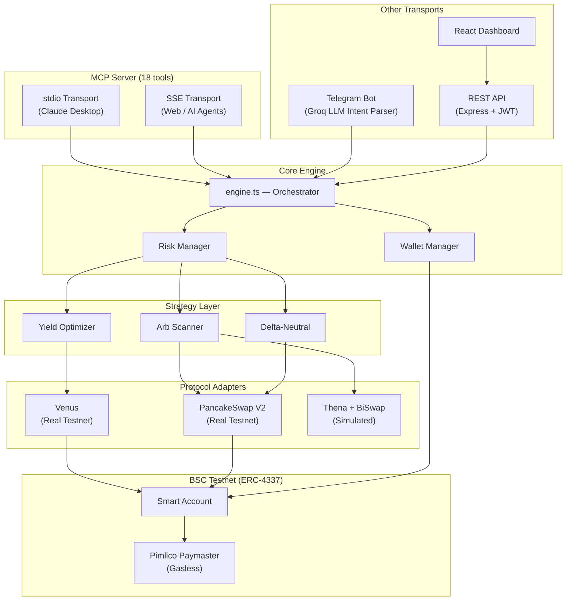

# DeFAI MCP — AI-Powered DeFi Agent for BNB Chain via Model Context Protocol

[](LICENSE)
[](https://nodejs.org/)
[](https://www.typescriptlang.org/)
[](https://www.bnbchain.org/)
[](https://eips.ethereum.org/EIPS/eip-4337)
[](https://modelcontextprotocol.io/)

**The first MCP server that gives AI agents real DeFi execution on BNB Chain.** 18 MCP tools for yield farming, cross-DEX arbitrage, and delta-neutral strategies — all gasless via ERC-4337 Account Abstraction.

---

## Why MCP?

AI assistants like Claude can reason about DeFi — but they can't **do** DeFi. There are zero MCP servers for on-chain DeFi operations on BNB Chain. DeFAI MCP changes that.

**With DeFAI MCP installed, Claude can:**
```
You:    "What are the best yields on BSC?"
Claude: [calls scan_markets tool] → "Venus BNB is at 3.8% APY, highest across 60+ pools"

You:    "Deposit 0.1 BNB into Venus"
Claude: [calls yield_deposit tool] → Real on-chain tx, gasless → "Done. Position tracked."

You:    "Run arbitrage for 6 hours, stop if I lose $5"
Claude: [calls arb_auto_start tool] → Autonomous bot scanning every 30s

You:    "How's my portfolio?"
Claude: [calls portfolio tool] → Full breakdown: positions, PnL, yield earned
```

This isn't a chatbot wrapper. It's a **full DeFi execution layer** exposed as MCP tools.

---

## 18 MCP Tools — Full DeFi Toolkit for AI Agents

| Tool | What it does |
|---|---|
| `ping` | Test connectivity to DeFAI MCP server |
| `wallet_setup` | Register/resume wallet, get Smart Account address |
| `scan_markets` | Live APYs (Venus/Beefy/DefiLlama), DEX prices, funding rates, arb spreads |
| `yield_deposit` | Deposit into highest-APY protocol (auto-selects best) |
| `yield_rotate` | Rotate position to higher APY when rates shift |
| `swap_tokens` | PancakeSwap V2 swap (BNB, USDT, any pair) |
| `arb_execute` | Scan cross-DEX spreads and execute best arbitrage |
| `arb_auto_start` | Start autonomous arb bot (scans every 30s for N hours) |
| `arb_auto_stop` | Stop the autonomous arb session |
| `arb_auto_status` | Check auto-arb P&L, trades executed, time remaining |
| `delta_neutral_open` | Open hedged position: spot buy + virtual short |
| `delta_neutral_close` | Close delta-neutral position, realize PnL |
| `risk_config` | View/update risk limits (position size, slippage, exposure) |
| `set_alerts` | Enable APY drop, arb opportunity, or position health alerts |
| `get_alerts` | View alert configs and last trigger times |
| `link_telegram` | Link Telegram for alert delivery |
| `portfolio` | Full portfolio: positions, PnL, yield earned |
| `trade_history` | Past trades with type/limit filters |

**MCP Resources:** `defai://protocols` — lists all supported protocols with real vs simulated status.

---

## Complete Setup Guide

Follow every step in order. Each step is required.

---

### Step 1 — Install prerequisites

You need **Node.js 18 or higher** and **npm 9 or higher**.

```bash
# Check your versions
node --version   # must be >= 18.0.0
npm --version    # must be >= 9.0.0
```

If Node.js is not installed, download it from [nodejs.org](https://nodejs.org/) (choose the LTS version).

---

### Step 2 — Get your API keys

You need **four external API keys** before you can run the project. Get them now, in any order.

#### 2a. Pimlico API key (pays gas fees for users)

1. Go to [dashboard.pimlico.io](https://dashboard.pimlico.io/)
2. Sign up for a free account
3. Create a new API key
4. In the API key settings, **enable BSC Testnet** (Chain ID 97)
5. Copy the key — it looks like `pim_xxxxxxxxxxxxxxxxxxxx`

#### 2b. Groq API key (LLM for Telegram natural language)

1. Go to [console.groq.com](https://console.groq.com/)
2. Sign up for a free account
3. Navigate to **API Keys** → **Create API Key**
4. Copy the key — it looks like `gsk_xxxxxxxxxxxxxxxxxxxx`

#### 2c. Telegram Bot token (bot interface)

1. Open Telegram and search for **@BotFather**
2. Send `/newbot`
3. Choose a name (e.g. `DeFAI Bharat`) and a username (e.g. `defai_bharat_bot` — must end in `bot`)
4. BotFather sends you a token — it looks like `123456789:ABCdef...`
5. Save both the **token** and the **@username** (without the `@`)

#### 2d. Generate a private key (your agent's on-chain identity)

This is an Ethereum EOA private key used to create your Smart Account on BSC Testnet. Generate one securely:

```bash
openssl rand -hex 32
# outputs: a64f3c...  (64 hex characters — this is your PRIVATE_KEY)
```

> **Important**: Never use a wallet that holds real mainnet funds. Generate a fresh key for this agent.

#### 2e. Generate a JWT secret (dashboard authentication)

```bash
openssl rand -base64 32
# outputs: something like: K9mX2p...== (this is your JWT_SECRET)
```

---

### Step 3 — Clone the repository and install dependencies

```bash
git clone https://github.com/<your-org>/defai-bharat.git
cd defai-bharat

# Install backend dependencies
# --legacy-peer-deps is required due to a viem/permissionless peer conflict
npm install --legacy-peer-deps

# Install dashboard dependencies
cd dashboard && npm install && cd ..
```

---

### Step 4 — Configure your environment file

Copy the example file and fill in every value:

```bash
cp .env.example .env
```

Open `.env` and set each variable:

| Variable | Required | What to put |
|---|---|---|
| `PRIVATE_KEY` | **Yes** | The 64-char hex key from Step 2d (with or without `0x` prefix) |
| `PIMLICO_API_KEY` | **Yes** | Your Pimlico key from Step 2a |
| `TELEGRAM_BOT_TOKEN` | **Yes** | The token from BotFather in Step 2c |
| `TELEGRAM_BOT_USERNAME` | **Yes** | Your bot's @username from Step 2c, **without** the `@` sign |
| `GROQ_API_KEY` | **Yes** | Your Groq key from Step 2b |
| `JWT_SECRET` | **Yes** | The base64 string from Step 2e |
| `BSC_TESTNET_RPC` | No | Leave blank to use the default public BSC Testnet RPC |
| `DEFAI_USER_ID` | No | Leave blank on first run — set later to resume an existing user in MCP mode |
| `MCP_TRANSPORT` | No | Leave blank (defaults to `stdio`). Set to `sse` for HTTP/SSE transport |
| `TINYFISH_API_KEY` | No | TinyFish web-scraping API key (optional feature) |

Your completed `.env` should look like:

```env
PRIVATE_KEY=a64f3c8d...your64hexchars...
PIMLICO_API_KEY=pim_xxxxxxxxxxxxxxxxxxxx
TELEGRAM_BOT_TOKEN=123456789:ABCdef...
TELEGRAM_BOT_USERNAME=defai_bharat_bot
GROQ_API_KEY=gsk_xxxxxxxxxxxxxxxxxxxx
JWT_SECRET=K9mX2p...==
BSC_TESTNET_RPC=
DEFAI_USER_ID=
MCP_TRANSPORT=
TINYFISH_API_KEY=
```

---

### Step 5 — Fund your Smart Account with testnet BNB

When you first start the agent, it creates a **Smart Account** (ERC-4337) derived from your private key. You need to send a small amount of BSC Testnet BNB to this address so it can execute transactions.

**5a. Start the agent to find your Smart Account address:**

```bash
npm run dev
```

Look for a log line like:
```
[INFO] Default user created: userId=1 smartAccount=0xYourSmartAccountAddress
```

Copy the `0xYourSmartAccountAddress` value.

**5b. Get testnet BNB from the faucet:**

1. Go to [testnet.bnbchain.org/faucet-smart](https://testnet.bnbchain.org/faucet-smart)
2. Paste your Smart Account address
3. Request testnet BNB (you'll receive 0.1 BNB)

**5c. Verify the balance:**

Check your Smart Account on [testnet.bscscan.com](https://testnet.bscscan.com) — paste your Smart Account address and confirm the BNB balance appears.

> Pimlico sponsors gas fees via the Paymaster, but the Smart Account still needs a small BNB balance for on-chain interactions on BSC Testnet.

---

### Step 6 — Start the backend

Open a terminal and run:

```bash
# Terminal 1: Start bot + background crons + REST API (all-in-one)
npm run dev
```

You should see output like:
```
[INFO] REST API server started on port 3002
[INFO] Telegram bot started (@your_bot_username)
[INFO] Yield watcher started (every 5 min)
[INFO] Arb watcher started (every 2 min)
[INFO] Position health watcher started (every 5 min)
[INFO] Snapshot logger started (every 5 min)
```

If you see errors, check the [Troubleshooting](#troubleshooting) section below.

---

### Step 7 — Start the dashboard

Open a **second terminal** (keep Terminal 1 running):

```bash
# Terminal 2: React dashboard (Vite dev server)
npm run dashboard
```

Then open [http://localhost:5173](http://localhost:5173) in your browser.

**Dashboard login:**
- The API is at `http://localhost:3002`
- Log in with the API key shown in the backend startup logs, or use the REST API to generate one

---

### Step 8 — Test the Telegram bot

1. Open Telegram
2. Search for your bot by its username (e.g. `@defai_bharat_bot`)
3. Send `/start`

The bot will create your user account and Smart Account. You should receive a welcome message with your Smart Account address.

Try these commands:
```
/start         — Register and see your wallet address
/portfolio     — View your positions and balances
scan markets   — Get live yield and price data
```

---

### Step 9 — (Optional) Connect Claude Desktop via MCP

This lets Claude Desktop call your DeFAI tools directly.

**9a. Find your Claude Desktop config file:**

| OS | Config file location |
|---|---|
| macOS | `~/Library/Application Support/Claude/claude_desktop_config.json` |
| Windows | `%APPDATA%\Claude\claude_desktop_config.json` |

**9b. Add DeFAI to the config:**

```json
{
  "mcpServers": {
    "defai": {
      "command": "npm",
      "args": ["run", "mcp"],
      "cwd": "/absolute/path/to/defai-bharat"
    }
  }
}
```

Replace `/absolute/path/to/defai-bharat` with the actual path where you cloned the repo.

**9c. Restart Claude Desktop.**

The 18 DeFAI tools now appear in Claude's tool palette. You can ask Claude things like:
- "What are the best yields on BSC right now?"
- "Deposit 0.05 BNB into the highest yield protocol"
- "Check my portfolio"

**MCP with SSE transport (for web apps or remote agents):**

```bash
# Terminal 3: MCP server with SSE (HTTP on port 3001)
npm run mcp:sse
```

Then connect with a Bearer token from your API key.

---

### Step 10 — Verify everything is working

```bash
# Backend health check
curl http://localhost:3002/api/health
# Expected: {"status":"ok","service":"defai-api","version":"1.0.0","chain":"BSC Testnet (97)"}

# Dashboard
open http://localhost:5173

# Telegram
# Send /portfolio to your bot — should return wallet info

# BSCScan — verify your Smart Account address has testnet BNB
# https://testnet.bscscan.com/address/0xYourSmartAccountAddress
```

---

### All available commands

| Command | What it starts | Port |
|---|---|---|
| `npm run dev` | Bot + crons + API server (all-in-one) | 3002 |
| `npm run mcp` | MCP server — stdio transport (for Claude Desktop) | stdin/stdout |
| `npm run mcp:sse` | MCP server — SSE transport (for web agents) | 3001 |
| `npm run api` | REST API only | 3002 |
| `npm run bot` | Telegram bot only | — |
| `npm run dashboard` | React dashboard (Vite dev server) | 5173 |
| `npm run build` | Compile TypeScript to `dist/` | — |

---

### Docker (one command, optional)

```bash
docker-compose up --build
# API + Dashboard on http://localhost:3002
```

> **Note**: MCP stdio transport cannot run in Docker — it requires a direct stdin/stdout connection to Claude Desktop. Run `npm run mcp` locally for Claude Desktop integration.

---

### Troubleshooting

| Error | Cause | Fix |
|---|---|---|
| `AA23 reverted` | EntryPoint/Factory version mismatch | Ensure both are v0.7 (check `src/utils/constants.ts`) |
| `ERESOLVE` on `npm install` | permissionless/viem `ox` peer dep conflict | Always use `npm install --legacy-peer-deps` |
| MCP server output breaks | Logger writing to stdout | pino must write to stderr (fd 2). Check `src/utils/logger.ts` |
| Bot ignores commands | Handler registration order | Commands must be registered before `bot.on('text')` |
| Wallet init hangs | Singleton `_initPromise` is stale | Restart the process |
| `Insufficient BNB` | Smart Account has no testnet BNB | Fund via [BSC Testnet Faucet](https://testnet.bnbchain.org/faucet-smart) |
| Dashboard shows 401 | JWT token expired or wrong secret | Check `JWT_SECRET` in `.env` matches what the API started with |
| Telegram bot not responding | Wrong token or username in `.env` | Double-check `TELEGRAM_BOT_TOKEN` and `TELEGRAM_BOT_USERNAME` |
| Groq errors | Invalid API key | Verify `GROQ_API_KEY` at [console.groq.com](https://console.groq.com/) |

---

## Architecture



---

## Tech Stack

| Layer | Technology |
|---|---|
| **MCP Server** | @modelcontextprotocol/sdk (stdio + SSE) |
| Blockchain | viem + BSC Testnet (Chain 97) |
| Account Abstraction | permissionless + Pimlico (ERC-4337 v0.7) |
| AI / LLM | Groq SDK (Llama 3.3 70B) |
| Telegram Bot | Telegraf |
| REST API | Express 5 + JWT |
| Dashboard | React + Vite + Tailwind CSS + React Query |
| Database | better-sqlite3 (WAL mode) |
| Encryption | AES-256-GCM + scrypt |
| Monitoring | node-cron (5 background watchers) |
| Language | TypeScript (strict mode, ES2022) |

---

## On-Chain Contracts (BSC Testnet)

| Contract | Address | Explorer |
|---|---|---|
| EntryPoint v0.7 | `0x0000000071727De22E5E9d8BAf0edAc6f37da032` | [View](https://testnet.bscscan.com/address/0x0000000071727De22E5E9d8BAf0edAc6f37da032) |
| SimpleAccountFactory v0.7 | `0x91E60e0613810449d098b0b5Ec8b51A0FE8c8985` | [View](https://testnet.bscscan.com/address/0x91E60e0613810449d098b0b5Ec8b51A0FE8c8985) |
| Pimlico Paymaster | `0x0000000000000039cd5e8aE05257CE51C473ddd1` | [View](https://testnet.bscscan.com/address/0x0000000000000039cd5e8aE05257CE51C473ddd1) |
| Venus vBNB | `0x2E7222e51c0f6e98610A1543Aa3836E092CDe62c` | [View](https://testnet.bscscan.com/address/0x2E7222e51c0f6e98610A1543Aa3836E092CDe62c) |
| PancakeSwap V2 Router | `0xD99D1c33F9fC3444f8101754aBC46c52416550D1` | [View](https://testnet.bscscan.com/address/0xD99D1c33F9fC3444f8101754aBC46c52416550D1) |
| WBNB Testnet | `0xae13d989daC2f0dEbFf460aC112a837C89BAa7cd` | [View](https://testnet.bscscan.com/address/0xae13d989daC2f0dEbFf460aC112a837C89BAa7cd) |
| USDT Testnet | `0x337610d27c682E347C9cD60BD4b3b107C9d34dDd` | [View](https://testnet.bscscan.com/address/0x337610d27c682E347C9cD60BD4b3b107C9d34dDd) |

---

## Documentation

| Document | Contents |
|---|---|
| [docs/PROJECT.md](docs/PROJECT.md) | Problem, solution, MCP tools, business model, roadmap |
| [docs/TECHNICAL.md](docs/TECHNICAL.md) | Architecture, setup guide, demo walkthrough |
| [docs/EXTRAS.md](docs/EXTRAS.md) | Demo video, slides, live access links |
| [bsc.address](bsc.address) | On-chain contract addresses |

---

## License

[MIT](LICENSE)

---

Built by **DefAI MCP** for the BNBChain Hackathon.
