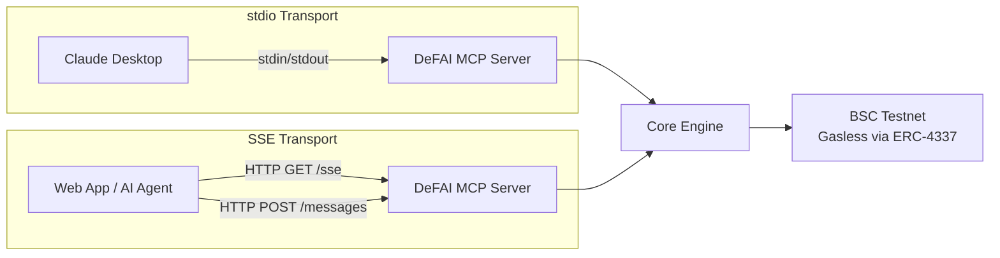
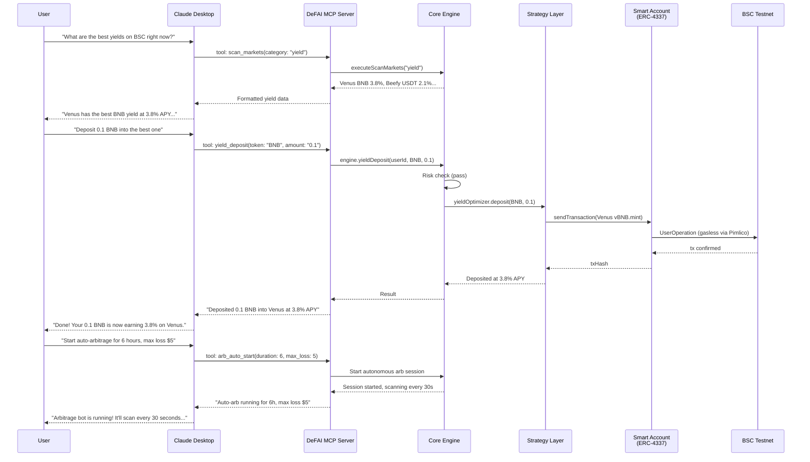
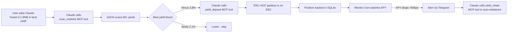
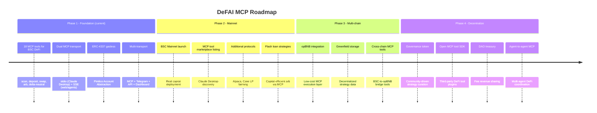

# DeFAI MCP: Problem, Solution & Impact

## 1. Problem

### DeFi is broken for humans — and AI agents can't access it either

Two critical gaps exist on BNB Chain today:

**For users:**
- **Information overload** -- 60+ yield pools across Venus, Beefy, PancakeSwap, and DefiLlama change APYs every block. No human can track them all in real-time.
- **Missed arbitrage** -- Cross-DEX price discrepancies between PancakeSwap, Thena, and BiSwap close within seconds. Manual traders miss 95%+ of profitable windows.
- **Gas friction** -- Every DeFi interaction costs gas. Users must hold BNB, estimate fees, and manage nonces -- a barrier for newcomers and a tax on every strategy.
- **Fragmented interfaces** -- Managing positions across lending, swapping, and hedging protocols requires switching between multiple UIs, wallets, and approval flows.

**For AI agents:**
- **No standard DeFi interface for AI** -- AI assistants like Claude, GPT, and others have no way to interact with DeFi protocols. There's no standard protocol for "scan yields" or "execute a swap" that an LLM can call.
- **MCP exists but DeFi tools don't** -- The Model Context Protocol (MCP) provides the standard for AI-tool communication, but there are virtually zero MCP servers for on-chain DeFi operations on BNB Chain.
- **AI can reason about DeFi but can't act** -- LLMs understand yield farming, arbitrage, and risk — but without execution tools, they're limited to giving advice instead of taking action.

### Who is affected?

| User segment | Pain point |
|---|---|
| **AI assistant users** | Claude/GPT can discuss DeFi but cannot execute any on-chain action |
| **Retail DeFi users** (~1M+ on BSC) | Under-optimized yields, missed rotations |
| **Non-technical crypto holders** | Overwhelmed by protocol complexity and gas |
| **Active traders** | Cannot match bot speed for arbitrage execution |
| **AI agent developers** | No composable DeFi building blocks for BNB Chain |

### Why does it matter?

The AI agent economy is exploding, but DeFi remains a walled garden. BNB Chain holds billions in TVL, yet there is **no MCP server that lets an AI agent deposit into Venus, swap on PancakeSwap, or execute arbitrage on BSC**. DeFAI MCP fills this gap — it's the bridge between AI agents and BNB Chain DeFi.

---

## 2. Solution

### DeFAI MCP: The first MCP-native DeFi agent for BNB Chain

DeFAI MCP is an **autonomous DeFi agent that exposes 18 MCP tools** for AI-driven yield farming, arbitrage, and delta-neutral strategies on BSC Testnet — all gasless via ERC-4337 Account Abstraction.

**The core innovation is the MCP server.** Any AI assistant that speaks the Model Context Protocol can now:

```
Claude: "scan_markets" → Live APYs, prices, funding rates, arb opportunities
Claude: "yield_deposit BNB 0.1" → Real on-chain Venus deposit (gasless)
Claude: "arb_auto_start 6h $5 max loss" → Autonomous arb bot for 6 hours
Claude: "portfolio" → Full position breakdown with PnL
```

This isn't a chatbot wrapper — it's a **full DeFi execution layer** accessible via MCP, Telegram, REST API, and a React dashboard.

### Why MCP is the key differentiator

| Approach | Can reason about DeFi? | Can execute on-chain? | Composable with any AI? |
|---|---|---|---|
| Traditional DeFi dashboards | No | Yes (manual) | No |
| Telegram DeFi bots | No | Yes (limited) | No |
| ChatGPT DeFi plugins | Yes | No (read-only) | Partially |
| **DeFAI MCP** | **Yes (Groq LLM)** | **Yes (real txs)** | **Yes (18 MCP tools)** |

### 18 MCP Tools — Full DeFi Toolkit for AI Agents

| Tool | What it does |
|---|---|
| `ping` | Test connectivity to DeFAI MCP server |
| `wallet_setup` | Register/resume wallet, get Smart Account address |
| `scan_markets` | Live APYs (Venus/Beefy/DefiLlama), DEX prices, funding rates, arb spreads |
| `yield_deposit` | Deposit tokens into highest-APY protocol (auto-selects best) |
| `yield_rotate` | Rotate position to higher APY if improvement > threshold |
| `swap_tokens` | PancakeSwap V2 token swap (BNB, USDT, any pair) |
| `arb_execute` | Scan cross-DEX spreads and execute the best arbitrage |
| `arb_auto_start` | Start autonomous arb bot (runs every 30s for N hours) |
| `arb_auto_stop` | Stop the autonomous arb session |
| `arb_auto_status` | Check auto-arb P&L, trades executed, time remaining |
| `delta_neutral_open` | Open hedged position: spot buy + virtual short |
| `delta_neutral_close` | Close delta-neutral position, realize PnL |
| `risk_config` | View/update per-user risk limits (position size, slippage, exposure) |
| `set_alerts` | Enable APY drop, arb opportunity, or position health alerts |
| `get_alerts` | View all alert configs and last trigger times |
| `link_telegram` | Link Telegram for alert delivery |
| `portfolio` | Full portfolio: positions, PnL, yield earned |
| `trade_history` | Past trades with type/limit filters |

**Plus MCP Resources:**
- `defai://protocols` — List of all supported protocols with real vs simulated status

### MCP Transport Modes

DeFAI MCP supports **two transport modes** for different integration patterns:



- **stdio** — For Claude Desktop integration. Add to `claude_desktop_config.json` and DeFAI tools appear natively in Claude's tool palette.
- **SSE (Server-Sent Events)** — For web apps, custom AI agents, or any HTTP client. Runs on port 3001 with Bearer token auth.

### How Claude Desktop uses DeFAI MCP



### Additional features beyond MCP

- **Telegram bot** -- Natural language interface powered by Groq Llama 3.3 70B. Parses "Invest 0.1 BNB" into structured DeFi intents.
- **REST API** -- JWT-authenticated endpoints for the React dashboard and programmatic access.
- **React dashboard** -- Portfolio visualization, trade history, market data, risk settings.
- **Gasless execution** -- All on-chain transactions via ERC-4337 Smart Accounts with Pimlico-sponsored gas.
- **Multi-user isolation** -- Each user gets their own Smart Account with AES-256-GCM encrypted private keys.
- **Real-time monitoring** -- 5 background cron jobs: APY drops, arb opportunities, position health, snapshots, auto-arb execution.
- **Risk management** -- Per-user configurable limits on position size, total exposure, slippage, and protocol allowlists.

### Value flow



---

## 3. Business & Ecosystem Impact

### Target users & adoption path

1. **AI-first users (primary)** -- Claude Desktop and MCP-compatible AI users who want DeFi access through their AI assistant. DeFAI MCP is installed as a tool, and Claude manages their DeFi portfolio through natural conversation. Reach via MCP tool directories, Claude Desktop marketplace, and AI agent communities.
2. **AI agent developers** -- Developers building autonomous agents who need composable DeFi building blocks. DeFAI's 18 MCP tools become Lego bricks for any AI-DeFi application. Reach via npm package and GitHub.
3. **Telegram DeFi users** -- Crypto-native users who want automation via Telegram. Natural language commands powered by Groq LLM. Reach via BSC Telegram communities.
4. **Non-technical crypto holders** -- Want yield without complexity. Zero wallet setup (AA handles it), zero gas management, plain English commands. Reach via simplified Telegram onboarding.

### Value to the BNB Chain ecosystem

- **First MCP-native DeFi server on BSC** -- Opens BNB Chain DeFi to the entire AI agent ecosystem
- **Showcases ERC-4337 on BSC** -- Working gasless Account Abstraction with Pimlico
- **AI agent composability** -- Any MCP-compatible AI (Claude, custom agents, autonomous systems) can now interact with BSC DeFi
- **Multi-protocol integration** -- Bridges Venus lending, PancakeSwap DEX, cross-DEX arb, and funding rate strategies into composable MCP tools
- **Standards-based** -- Built on the open Model Context Protocol, not a proprietary API

### Monetization (fee-based model)

| Revenue stream | Rate | Description |
|---|---|---|
| Management fee | 0.5% | Annual fee on yield-generating positions |
| Performance fee | 10% | Fee on arbitrage profits (only on gains) |
| Premium tier | Subscription | Auto-arb sessions, advanced strategies, priority alerts |
| Free tier | $0 | Market scanning, portfolio tracking, manual MCP tool access |

### GTM strategy

1. **Launch** -- Publish DeFAI MCP server to Claude Desktop tool directory. Public Telegram bot with free tier.
2. **Developer adoption** -- npm package for AI agent developers. GitHub repo with clear MCP integration docs.
3. **Community** -- BSC DeFi communities, MCP developer ecosystem, AI agent builder forums.
4. **Scale** -- Multi-chain MCP tools (opBNB, Greenfield), agent-to-agent DeFi coordination.

---

## 4. Limitations & Future Work

### Current limitations

| Limitation | Reason | Mitigation |
|---|---|---|
| Thena/BiSwap execution is simulated | No testnet contracts available | Uses real mainnet price data; flagged as `isSimulated: true` |
| Delta-neutral short leg is virtual | No perpetual DEX on BSC Testnet | Tracks real Binance funding rates |
| Single chain (BSC Testnet) | MVP scope | Architecture supports multi-chain extension |
| No on-chain strategy verification | Off-chain engine | All trades logged with txHash for auditability |
| MCP stdio can't run in Docker | stdin/stdout limitation | SSE transport available for remote/containerized deployment |

### Risks

- **Smart contract risk** -- Venus/PancakeSwap contract vulnerabilities. Mitigated by using battle-tested protocols.
- **Oracle risk** -- Price feeds from CoinGecko/DexScreener could be manipulated. Mitigated by multi-source aggregation.
- **Key custody** -- Encrypted keys stored in SQLite. Mitigated by AES-256-GCM + scrypt derivation.
- **MCP adoption** -- MCP is still early. Mitigated by supporting 4 transports (MCP, Telegram, API, Dashboard) so the agent works without MCP too.

### Roadmap


