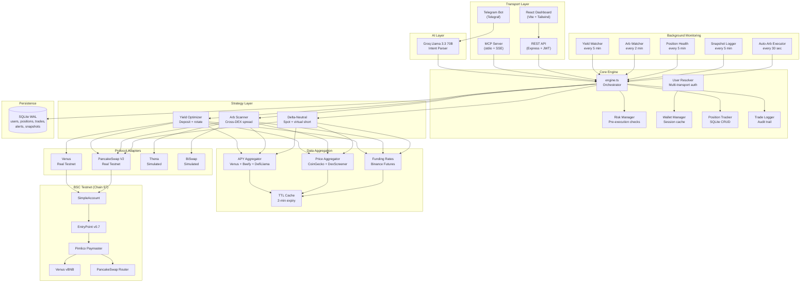
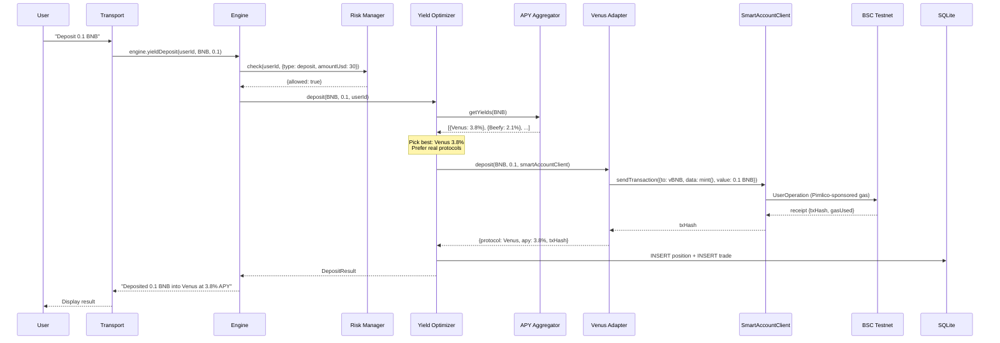
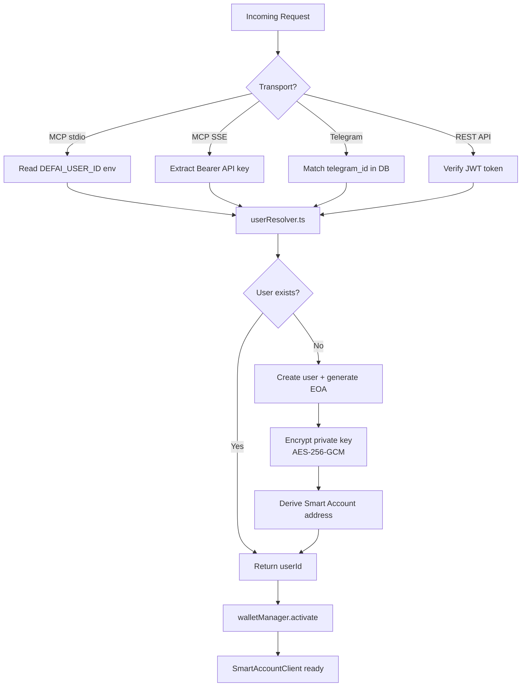
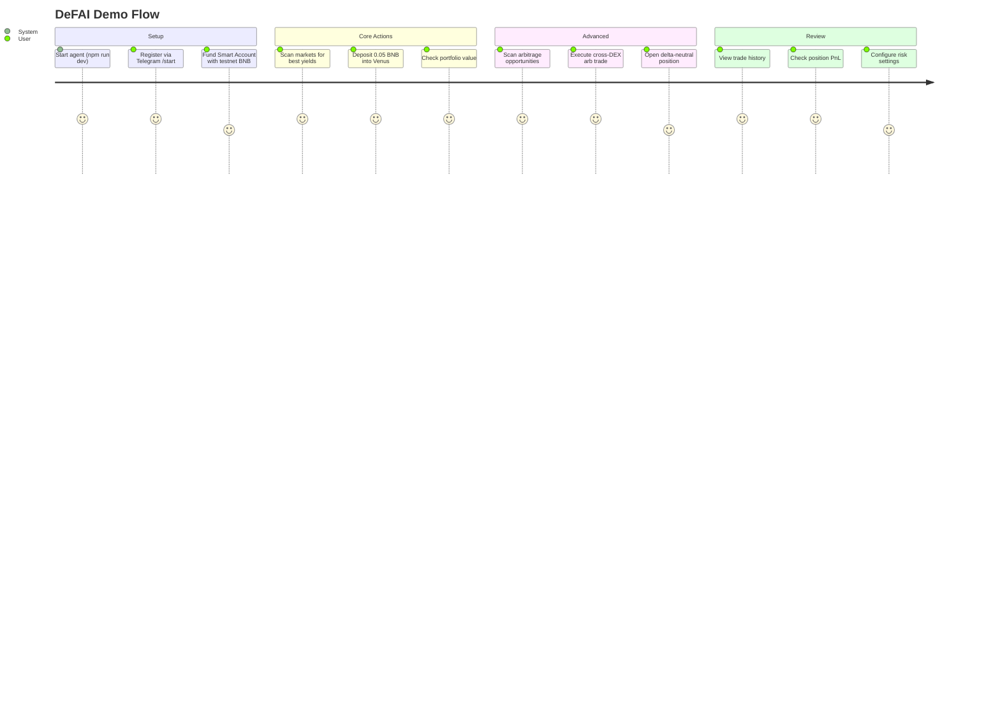

# DeFAI MCP: Technical Documentation

## 1. Architecture

### System overview

DeFAI MCP is built around a **Model Context Protocol (MCP) server** that exposes 18 DeFi tools to any AI agent. The MCP server is the primary interface — it's how Claude Desktop (and any MCP-compatible AI) interacts with BNB Chain DeFi.

Under the hood, the MCP server calls the same **central engine orchestrator** as the Telegram bot, REST API, and React dashboard. All four transports call `engine.*()` methods — no transport ever calls strategies or adapters directly. This ensures consistent behavior, logging, and risk checks regardless of how the user interacts.

### System architecture



### MCP Server — the primary AI interface

The MCP server (`src/mcp/server.ts`) is the core component that differentiates DeFAI from traditional DeFi tools. It implements the **Model Context Protocol** standard, exposing 18 tools that any MCP-compatible AI agent can call.

**Implementation details:**
- Built on `@modelcontextprotocol/sdk` v1.27
- **18 registered tools** via `server.tool()` — each with Zod schema validation, descriptions, and error handling
- **1 MCP resource** (`defai://protocols`) — lists supported protocols with real vs simulated status
- **Session management** — maps MCP sessionId to userId for multi-user isolation
- **Two transports:**
  - **stdio** — for Claude Desktop integration (stdin/stdout JSON-RPC)
  - **SSE** — for web apps and remote AI agents (HTTP on port 3001 with Bearer token auth)

**How Claude Desktop discovers the tools:**
```json
// claude_desktop_config.json
{
  "mcpServers": {
    "defai": {
      "command": "npm",
      "args": ["run", "mcp"],
      "cwd": "/path/to/defai-bharat"
    }
  }
}
```

When Claude Desktop starts, it launches the MCP server process, discovers all 18 tools via the MCP handshake, and presents them to Claude as callable functions. Claude can then autonomously decide which tools to call based on user requests.

**MCP tool categories:**

| Category | Tools | Description |
|---|---|---|
| **Setup** | `ping`, `wallet_setup`, `link_telegram` | Connectivity, wallet registration, transport linking |
| **Market Data** | `scan_markets` | Live APYs, prices, funding rates, arb opportunities |
| **Yield** | `yield_deposit`, `yield_rotate` | Deposit into best protocol, rotate to higher APY |
| **Trading** | `swap_tokens`, `arb_execute` | PancakeSwap V2 swaps, cross-DEX arbitrage |
| **Auto-Arb** | `arb_auto_start`, `arb_auto_stop`, `arb_auto_status` | Autonomous arb bot (30s interval, configurable duration/loss limits) |
| **Delta-Neutral** | `delta_neutral_open`, `delta_neutral_close` | Hedged positions: spot + virtual short |
| **Risk** | `risk_config` | Per-user position size, exposure, slippage limits |
| **Alerts** | `set_alerts`, `get_alerts` | APY drop, arb opportunity, position health notifications |
| **Portfolio** | `portfolio`, `trade_history` | Position breakdown, PnL, trade log |

### Components

| Component | Technology | Purpose |
|---|---|---|
| **MCP Server** (`src/mcp/server.ts`) | @modelcontextprotocol/sdk | **18 tools for AI agents** (stdio + SSE) |
| **Core Engine** (`src/core/engine.ts`) | TypeScript | Single orchestrator — MCP + all transports call this |
| **Telegram Bot** (`src/bot/index.ts`) | Telegraf + Groq LLM | Natural language commands via chat |
| **REST API** (`src/api/server.ts`) | Express 5 + JWT | Dashboard backend + programmatic access |
| **Dashboard** (`dashboard/`) | React + Vite + Tailwind | Web UI for portfolio, trades, markets |
| **Wallet** (`src/wallet/pimlico.ts`) | permissionless + Pimlico | ERC-4337 Smart Account management |
| **Database** (`src/core/db.ts`) | better-sqlite3 (WAL) | Users, positions, trades, alerts, snapshots |
| **Strategies** (`src/core/strategy/`) | TypeScript | Yield, arbitrage, delta-neutral logic |
| **Adapters** (`src/adapters/`) | viem | Protocol-specific contract interactions |
| **Monitors** (`src/monitor/`) | node-cron | Background watchers + alert dispatch |

### Data flow — yield deposit example



### Multi-transport authentication



### On-chain vs off-chain

| Component | Execution | Data source |
|---|---|---|
| Venus supply/withdraw | **Real on-chain** (BSC Testnet) | Venus governance API for APY |
| PancakeSwap V2 swaps | **Real on-chain** (BSC Testnet) | On-chain `getAmountsOut()` for quotes |
| Thena DEX quotes | Simulated (`0xsim_*` txHash) | DexScreener API (real prices) |
| BiSwap quotes | Simulated (`0xsim_*` txHash) | DexScreener API (real prices) |
| Beefy vault APYs | Data only (no execution) | Beefy API (real APYs) |
| DefiLlama yields | Data only (no execution) | DefiLlama API (real APYs) |
| Delta-neutral short | Virtual tracking | Binance Futures API (real funding rates) |
| Position tracking | Off-chain | SQLite database |
| Intent parsing | Off-chain | Groq Llama 3.3 70B |
| Account Abstraction | **Real on-chain** | Pimlico bundler + paymaster |

### Security

- **Private key encryption**: AES-256-GCM with scrypt key derivation. Keys encrypted at rest in SQLite, decrypted only during wallet activation.
- **API authentication**: JWT tokens (7-day expiry) for dashboard, API keys (`dfai_k_*`) for programmatic access.
- **No secrets in code**: All credentials loaded from environment variables. `.env` excluded from git via `.gitignore`.
- **Risk management**: Pre-execution checks on every strategy call -- position size limits, total exposure caps, slippage bounds, protocol allowlists.
- **Logging**: pino logger writes to stderr (not stdout) to avoid breaking MCP stdio protocol.

---

## 2. Setup & Run

### Prerequisites

| Requirement | Version | Notes |
|---|---|---|
| Node.js | >= 18.0.0 | Required for ES2022 features |
| npm | >= 9.0.0 | Comes with Node.js |
| BSC Testnet BNB | Any amount | [Faucet](https://www.bnbchain.org/en/testnet-faucet) |
| Pimlico API key | Free tier | [pimlico.io](https://www.pimlico.io/) |
| Groq API key | Free tier | [console.groq.com](https://console.groq.com/) |
| Telegram Bot Token | Free | [BotFather](https://t.me/BotFather) |

### Environment variables

Copy `.env.example` to `.env` and fill in:

```bash
cp .env.example .env
```

| Variable | Required | Where to get it |
|---|---|---|
| `PRIVATE_KEY` | Yes | Any hex private key (generate with `openssl rand -hex 32`) |
| `PIMLICO_API_KEY` | Yes | [pimlico.io/dashboard](https://dashboard.pimlico.io/) -- select BSC Testnet |
| `TELEGRAM_BOT_TOKEN` | Yes | [@BotFather](https://t.me/BotFather) on Telegram |
| `GROQ_API_KEY` | Yes | [console.groq.com/keys](https://console.groq.com/keys) |
| `JWT_SECRET` | Yes | Any random string (e.g. `openssl rand -base64 32`) |
| `BSC_TESTNET_RPC` | No | Custom RPC URL (defaults to public BSC Testnet) |
| `MCP_TRANSPORT` | No | `stdio` (default) or `sse` |
| `DEFAI_USER_ID` | No | Resume as existing user in MCP mode |

### Install & build

```bash
# Clone the repository
git clone https://github.com/<your-org>/defai-bharat.git
cd defai-bharat

# Install dependencies (--legacy-peer-deps needed for permissionless/viem peer conflict)
npm install --legacy-peer-deps

# Build TypeScript
npm run build

# Install dashboard dependencies
cd dashboard && npm install && cd ..
```

### Run

| Command | What it starts | Port |
|---|---|---|
| `npm run dev` | Bot + crons + API server (all-in-one) | 3002 |
| `npm run mcp` | MCP server (stdio for Claude Desktop) | stdin/stdout |
| `npm run mcp:sse` | MCP server (SSE transport) | 3001 |
| `npm run api` | REST API only | 3002 |
| `npm run bot` | Telegram bot only | -- |
| `npm run dashboard` | React dashboard (Vite dev server) | 5173 |

**Quick start (recommended):**

```bash
# Terminal 1: Start backend (bot + crons + API)
npm run dev

# Terminal 2: Start dashboard
npm run dashboard

# Terminal 3 (optional): Start MCP server for Claude Desktop (stdio)
npm run mcp

# Terminal 3 (alternative): Start MCP server with SSE transport (web agents / remote)
npm run mcp:sse
```

> **MCP note**: `npm run mcp` uses stdio transport — it must run as a subprocess launched by Claude Desktop (configured in `claude_desktop_config.json`), not as a standalone terminal process. Use `npm run mcp:sse` for standalone HTTP access on port 3001.

### Docker (one command)

```bash
# Build and start everything
docker-compose up --build

# Or in background
npm run docker:up

# Stop
npm run docker:down
```

Docker runs the backend on port 3002 and serves the dashboard from the same port.

> **Note**: MCP stdio transport cannot run in Docker (it communicates via stdin/stdout with the local Claude Desktop process). Run `npm run mcp` locally for Claude Desktop integration.

### Verify

```bash
# 1. Health check
curl http://localhost:3002/api/health
# Expected: {"status":"ok","service":"defai-api","chain":"BSC Testnet (97)"}

# 2. Dashboard
open http://localhost:5173  # (or :3002 in Docker)

# 3. Telegram
# Send /start to your bot

# 4. MCP (Claude Desktop)
# Add to claude_desktop_config.json:
# { "mcpServers": { "defai": { "command": "npm", "args": ["run", "mcp"], "cwd": "/path/to/defai-bharat" } } }
```

---

## 3. Demo Guide

### Access points

| Interface | How to access |
|---|---|
| **Telegram** | Search for your bot username, send `/start` |
| **Dashboard** | Open `http://localhost:5173` (dev) or `:3002` (Docker) |
| **API** | `curl http://localhost:3002/api/...` with JWT token |
| **MCP** | Configure in Claude Desktop, then use tools |

### Step-by-step user flow

#### 1. Start the agent
```bash
npm run dev
```
You should see:
```
[INFO] REST API server started on port 3002
[INFO] Telegram bot started
[INFO] Yield watcher started (every 5 min)
[INFO] Arb watcher started (every 2 min)
```

#### 2. Register (Telegram)
Send `/start` to your Telegram bot. It creates your user account and Smart Account automatically.

#### 3. Scan markets
```
You: "Scan markets"
Bot: Market Overview:
     Yields: Venus BNB 3.8% APY, Beefy USDT 2.1%...
     Arbitrage: WBNB spread PancakeSwap→Thena 0.45%
     Funding: BNB +0.01% (longs pay shorts)
```

#### 4. Deposit into best yield
```
You: "Invest 0.05 BNB in best yield"
Bot: Deposited 0.05 BNB into Venus at 3.8% APY
     Tx: 0xabc...def (gasless)
     Position tracked.
```

#### 5. Check portfolio
```
You: /portfolio
Bot: Portfolio Value: $15.20
     Active Positions:
     - Venus BNB: 0.05 BNB @ 3.8% APY
```

#### 6. Execute arbitrage
```
You: "Find and execute arbitrage"
Bot: Found: WBNB spread 0.45% (PancakeSwap→Thena)
     Executing... Bought on PancakeSwap, sold on Thena
     Profit: $0.12
```

#### 7. Open delta-neutral position
```
You: "Open delta-neutral on BNB"
Bot: Delta-neutral position opened:
     Spot: Bought 0.05 BNB via PancakeSwap
     Short: Virtual short tracking Binance funding
     Net delta: ~0 | Funding yield: +0.01%/8h
```

#### 8. Review trades
```
You: /trades
Bot: Recent trades:
     1. DEPOSIT Venus BNB 0.05 @ 3.8% APY
     2. ARB_BUY PancakeSwap WBNB 0.01
     3. ARB_SELL Thena WBNB 0.01 (+$0.12)
     4. SPOT_BUY PancakeSwap BNB 0.05
```

### Expected outcomes

| Action | Expected result |
|---|---|
| Scan markets | JSON with yields, prices, funding rates, arb opportunities |
| Yield deposit | Real Venus tx (txHash on BSCScan), position in portfolio |
| PancakeSwap swap | Real tx, token balance updated |
| Arbitrage | Buy on one DEX, sell on another (PancakeSwap real, others simulated) |
| Delta-neutral | Spot leg real, short leg virtual with funding tracking |

### Troubleshooting

| Issue | Cause | Fix |
|---|---|---|
| `AA23 reverted` | EntryPoint/Factory version mismatch | Ensure both are v0.7 (check `src/utils/constants.ts`) |
| `ERESOLVE` on `npm install` | permissionless/viem `ox` peer dep conflict | Use `npm install --legacy-peer-deps` |
| MCP server breaks | Logger writing to stdout | pino must use stderr (fd 2). Check `src/utils/logger.ts` |
| Bot ignores commands | Handler registration order | Commands must be registered before `bot.on('text')` |
| Wallet init hangs | Singleton `_initPromise` stale | Restart the process |
| Insufficient BNB | Smart account needs testnet BNB | Fund via [BSC Testnet Faucet](https://www.bnbchain.org/en/testnet-faucet) |

### Demo user journey


